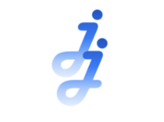
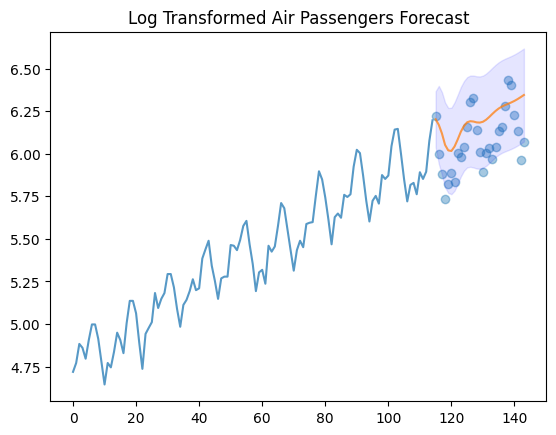
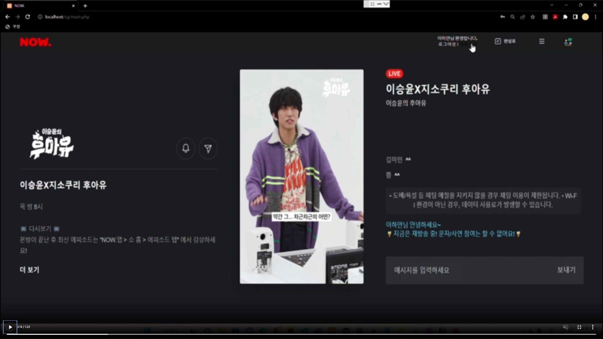

## Introduction.
------

### 백엔드 개발 경험을 바탕으로 데이터 중심의 AI 시스템을 구축하고, 기록하고 공유하며 **함께 성장하는** **신입 데이터 사이언티스트** 이하얀입니다.
#### 1. 백엔드 개발 경험을 살려 데이터 사이언티스트가 되기 위한 성장을 하고 있습니다.👩🏻‍💻
- Python, SQL, Jupyter Notebook, Google Colab을 활용해 데이터 분석 및 ML/DL 모델(CNN, RNN, Transformer) 최적화 수행  
- 백엔드 개발·운영 경험을 바탕으로 데이터 처리부터 모델 배포까지 전 과정 이해 및 실습  
- 데이터 수집, 전처리, 분석, 배포, API 연동까지 고려하는 백엔드 친화적 데이터 사이언티스트로서 협업 및 모델 개발 역량 강화

#### 2. 금융 데이터를 활용한 인사이트 도출 및 모델링을 진행합니다.
- **금융 도메인의 시계열 데이터 분석 및 NLP 프로젝트 진행** : 시계열 데이터 처리 및 금융 특화 NLP 모델 최적화
  - **MIMIC-III 활용:** ICU 환자의 항생제 사용과 치료 성공률 분석 (최대 ROC-AUC `0.803`, XGB)  
  - **Naive RAG 구축:** 금융 뉴스 요약 시스템 개발 (뉴스 사이트 API)  
  - **VectorDB & Advanced RAG:** 금융 보고서(KIS Weekly Report) 기반 RAG 시스템 구축

#### 3. 사용자를 위한 서비스를 배포하고, 문제를 개선하는 일을 좋아합니다.
- **백엔드 API 배포·운영 경험 보유**  
  - AWS, Docker, GitHub Actions, Nginx 활용 **CI/CD 배포** 진행  
  - 단순 코드 작성이 아닌 **서비스 개발·운영 및 유저 관점에서의 이해** 역량 강화
  - 주차장 인기도 실시간 반영 : [MySQL이 아닌 Redis를 도입](https://velog.io/@dlgkdis801/SpringBoot-Redis-%EB%A9%94%EC%9D%B8-%ED%99%94%EB%A9%B4-%EC%9D%B8%EA%B8%B0-%EC%A3%BC%EC%B0%A8%EC%9E%A5-%EB%9D%84%EC%9A%B0%EA%B8%B0)
  - 도메인 접근 지연 원인 분석 및 서버 중단 방지 : [임시로 유저 캐시를 삭제하여 접근 시간을 2초 이내로 줄인 뒤 추후, RDBMS로 캐시를 이관](https://www.notion.so/Day-1-23-12-13-2fe99cf7e40f4de5b45044f727a00620?pvs=21)
    

#### 4. 정리하고 계획하는 일을 좋아합니다.
- [Velog에 학습 기록 및 트러블슈팅](https://velog.io/@dlgkdis801/series) 정리 → **비효율적 반복 작업 최소화 & 코드·모델 개선 고민**  
- [Notion, Slack, Jira](https://www.notion.so/166375128d5048d8b72a4a621fca15c6?pvs=21) → '함께'하며 규모있는 성과를 내기 위한 팀 프로젝트 기획 및 적극적 커뮤니케이션 경험  

#### 5. 데이터 사이언티스트로 성장하기 위해 노력하고 있습니다. 🚀
- **데이터 사이언스 & 엔지니어링**  
  - **금융 시계열 분석 및 예측** : [Finance Time Series 프로젝트](https://velog.io/@dlgkdis801/MainQuest08-%ED%94%84%EB%A1%9C%EC%A0%9D%ED%8A%B8-Finance-Time-Series-%EB%8D%B0%EC%9D%B4%ED%84%B0-%ED%99%9C%EC%9A%A9%ED%95%98%EA%B8%B0), [ARIMA, ARCH 분석](https://velog.io/@dlgkdis801/MiniProject-Node-08.-ARIMA-ARCH), 이상 거래 탐지 프로젝트  

  - **금융 NLP 모델 최적화** : [LangChain 기반 금융 뉴스 요약](https://github.com/hayannn/FinPin_LangchainTon), [KIS Weekly Report 기반 RAG 시스템](https://github.com/DS3th-AIFFEELTHON/Bogosa)  
    - AirFlow 파이프라인 제작 및 GCP, GKE, Milvus 배포

#### 5. 발전 방향은 다음과 같습니다. 🏃🏻‍♀️
- **데이터 양이 제한적인** 환경에서의 **로직 최적화**와 **성능 개선** 경험을 바탕으로, 금융 도메인에서 **시계열 데이터** 및 **대규모 데이터 모델 최적화**, **API 연동 시 서버 부하 최소화**와 **확장 가능성** 고민
- 그동안의 API 개발 경험을 통해 **데이터 특성 반영** 및 **최적 기술 도입**, **모델 경량화**를 시도하며, **대량 데이터 요청 시 서버 부하 최소화** 기법과 **효율적 데이터 파이프라인 구축** 연구 
- 이 경험을 바탕으로 **개발자** 및 **데이터 엔지니어와의 협업**을 통해 발전하는 데이터 사이언티스트로 성장중

## Experience.
------
🏫 아이펠 데이터 사이언티스트 3기 (2024.10 - 2024.03)

- (주) 모두의 연구소
- Data Scientist
- 데이터 사이언티스트 전문과정 3기 참여 및 데이터 사이언스 역량 강화

🏫 자기계발 챌린지 빡공단 43기 (2024.02)

- (주) 베어유
- Fullstack
- Django를 이용한 익명게시판 프로젝트 풀스택 개발 진행

🏫 휴맥스 드림버스 컴퍼니 인턴십 (2023.11 - 2023.12)

- 참여 기업: (주) 휴맥스모빌리티
- Backend
- SW개발팀 16조 Backend 인턴십 참여를 통해 주차장 공유 플랫폼 API 개발

🏫 Smailgate 윈터데브캠프 2기 (2022.11 - 2023.02)

- (주) 스마일게이트 홀딩스
- Backend
- 팀 All-IN Backend 개발자로 참여하여 실시간 스트리밍 API 개발

🏫 코딩월드뉴스(CWN) 에디터 2기 (2021.01 - 2021.07)

- (주) 코인리더스
- Editor
- 코딩월드뉴스 채널을 통해 7개월간 대학생 에디터 활동 진행

## Experience.
------
📍 데이터 분석 준전문가(ADsP) (2025.03)
- 데이터자격검정

📍 SQL 개발자(SQLD) (2024.09)
- 데이터자격검정

📍 PCCE(Programmers Certified Coding Essential) Java Lv2 (2024.08)
- (주)그렙

📍 리눅스 마스터 2급 (2022.09)
- 한국정보통신진흥협회

## Education.
------
🏫 전주대학교 (2020.03 - 2024.02)

- 컴퓨터공학과 수석 졸업
- GPA: 4.31 / 4.5 (Major: 4.27 / 4.5)

## 📊 Awards.
------
🏆 제 3회 오아시스해커톤 최우수상 (2022.07)

- 전남대학교 소프트웨어중심대학사업단

🏆 전주대학교 소프트웨어 부트캠프 장려상 (2021.11)

- 전주대학교

🏆 전주대학교 비교과 프로그램 수기 공모전 우수상 (2021.01)

- 전주대학교

🏆 전주대학교 재학생 성적 우수상 (5회)

- 전주대학교

🏆 전주대학교 재학생 학부/과수석 (2회)

- 전주대학교

## Currently in progress.
------
### **👩🏻‍💻 AIFFEL 데이터사이언티스트 전문 과정 3기**

**Data Scientist** @ AIFFEL  (2024.10.07 - 2025.04.01)

모두의 연구소(아이펠) [데이터사이언티스트 전문 과정 3기](https://camp.modulabs.co.kr/ds#:x6iRz2m4Z) 참여

데이터 분석, 통계, 시계열 분석, 머신러닝, 딥러닝, 추천 시스템, MLOps까지의 전 과정을 프로젝트 기반으로 학습했으며, 데이터톤과 랭체인톤을 거쳐 최종 기업 협업 프로젝트 진행

#### 주요 프로젝트
1. 데이터톤 : MeMI_ICU 내 항생제 치료 전략 및 다제내성균(MDR) 감염 치료 성공률 분석 프로젝트 [🔗 GitHub](https://github.com/hayannn/MeMI_ALFFEL_DATATHON)
2. 랭체인톤 : 금융핀_AI 기반 금융 뉴스 요약 솔루션: 뉴스 사이트에서 제공하는 데이터셋을 기반으로한 금융 뉴스 요약 RAG 프로젝트 [🔗 GitHub](https://github.com/hayannn/FinPin_LangchainTon) [🔗 Deploy](https://github.com/hayannn/FinPin_Deploy)
3. 기업 협업 프로젝트 : 보고사_금융 보고서 기반 VectorDB 및 RAG 시스템 구축 [🔗 GitHub](https://github.com/DS3th-AIFFEELTHON/Bogosa) [🔗 Notion](https://hayanlee.notion.site/1c4022a887d980658b1cfafc1f23936a?pvs=4)

## Field Experience.
------
### 👩🏻‍💻 휴맥스 드림버스 컴퍼니 인턴십
**Backend Developer** @ HumaxMobility  (2023.11.01 - 2023.12.10)

- 휴맥스 드림버스컴퍼니 재택 참여형 인턴십 프로그램에 참여하여 SW개발팀 16조 백엔드 개발자로 7주간 근무

#### Turu-Parking
- 주제 : Humax mobility의 주차 시설 기반 주변 주차장 공유 플랫폼 개발
  - 실제 휴맥스 모빌리티 주차장 데이터를 이용해 소셜로그인 및 주변 주차장 공유 REST API를 모두 공동으로 구축하고 배포하는 백엔드 포지션으로 팀프로젝트 진행
    - 팀 구성 : 프론트엔드 2명, 백엔드 3명
- Admin API : CRUD 기반 API, Parking API : 일반 사용자가 접근 가능한 REST API 개발
- 담당 역할
  - [인기도순 주차장 데이터 정렬을 통한 메인 페이지의 API](https://velog.io/@dlgkdis801/SpringBoot-Redis-%EB%A9%94%EC%9D%B8-%ED%99%94%EB%A9%B4-%EC%9D%B8%EA%B8%B0-%EC%A3%BC%EC%B0%A8%EC%9E%A5-%EB%9D%84%EC%9A%B0%EA%B8%B0) 기능 개발,  [접근 빈도가 높은 search_count 데이터를 Redis에 저장](https://velog.io/@dlgkdis801/SpringBoot-Redis-%EC%82%AC%EC%9A%A9%ED%95%98%EA%B8%B0)하도록 프로젝트 수정
  - 휴맥스모빌리티에서 제공한 주차장 데이터의 주소 정보를 [geocode로 가공](https://www.notion.so/Geocode-d54f3572fbe64fc1a036d4c55d456215?pvs=21)하여 위도 및 경도 데이터를 추출해 [ST_Distance_Sphere로 반경 내 위치를 찾는 로직](https://www.notion.so/e4541aa89d2f44f29b06d6afc0331ee4?pvs=21) 공동 구현 ➡️ RDS 버전 이슈 발생으로 인해 [로직을 Haversine으로 변경하여 적용](https://github.com/humax-sw-team16/Parking_Server/blob/PJH/src%2Fmain%2Fjava%2Fcom%2Fhumax%2Fparking%2Frepository%2FUserRepository.java)

- 배포
  - https://www.turu-parking.com (인턴십 종료로 인해 현재 배포 중단)

- 기술스택
  - Framwork/Library : SpringBoot, Spring Security, Spring Data JPA, JWT, OAuth2, Lombok, QueryDSL, Swagger
  - Database : MySQL, Redis
  - IDE : IntelliJ IDEA
  - Server : AWS EC2, AWS RDS, GitHub, GitHub Actions, Docker, Nginx, Let’s Encrypt
  - Collaboration : Postman(Swagger와 함께 사용), Notion, Figma, ZEP

- Link
  - [Team&Personal Notion](https://hayanlee.notion.site/Team-Personal-Notion-187022a887d981abba62f02e79a305dc?pvs=4)
  - [Velog](https://velog.io/@dlgkdis801/series/%ED%9C%B4%EB%A7%A5%EC%8A%A4-%EB%93%9C%EB%A6%BC%EB%B2%84%EC%8A%A4%EC%BB%B4%ED%8D%BC%EB%8B%88-%EC%9D%B8%ED%84%B4%EC%8B%AD)
  - [Detail & TroubleShooting](https://hayanlee.notion.site/Detail-TroubleShooting-187022a887d98159a15cd2403c8cfd54?pvs=4)
  - [Project Video](https://www.youtube.com/watch?v=JY-Au51rYAA)

## Skills.
------
[**Language**](https://www.notion.so/Appendix-1c7022a887d9801892a9c31d2a868c15?pvs=21)

- **Python**
- **SQL**

[**🩵Data🩵**](https://www.notion.so/Appendix-1c7022a887d9801892a9c31d2a868c15?pvs=21)

- EDA : **Pandas, NumPy**, BigQuery
- Visualization : **Matplotlib**, Pyplot, Seaborn
- ML
    - Linear Regression, Logistic Regression, Decision Tree
    - **PCA, Random Forest**, LightGBM, **XGBoost**
    - Ensemble(Bagging, Boosting, Stacking), k-NN
- DL
    - **TensorFlow**, CNN, AutoInt, AutoInt+

[**🩵LangChain🩵**](https://www.notion.so/Appendix-1c7022a887d9801892a9c31d2a868c15?pvs=21)

- LLM : **OpenAI API, Upstage API**
- Retriever : BM25, **KiwiBM25**, Milvus, Ensemble
- Vector DB : **Milvus**, Chroma, FAISS
- Data type : Document(PDF, json, jsonl) , API(Naver Search API)

[**Tools**](https://www.notion.so/Appendix-1c7022a887d9801892a9c31d2a868c15?pvs=21)

- **Jupyter Notebook, Google Colab**
- IDE - **VScode**
- Deploy - **Git, GitHub**, GitHub Actions, **Docker**, GCP, AWS EC2, Streamlit, Streamlit Cloud
- Collaboration - Slack, **Notion**, Jira, Figma

[**Etc**](https://www.notion.so/Appendix-1c7022a887d9801892a9c31d2a868c15?pvs=21)

- OS : Windows, MacOS, Linux(CentOS)
- Backend - Java, PHP, SpringBoot, Spring Data JPA
- Frontend - JavaScript, HTML5, CSS3
- MySQL, MariaDB, Redis
- IDE - IntelliJ IDEA, AndroidStudio

## Project.
------
### Core Team Projects.
### Data Science
#### 1️⃣ [보고사_채권 리포트 기반 VectorDB 및 RAG 시스템 구축](https://github.com/DS3th-AIFFEELTHON/Bogosa) (2025.02 - 2025.03)

- 팀 구성 : DS 3명
- KIS Weekly Report를 기반으로 최적 VectorDB를 생성하고, RAG 기법 최적화 및 신뢰도 높은 금융 특화 LLM 환경을 구축하는 프로젝트를 진행했습니다.
- Naive RAG → Text, Table, Image(Graph) 멀티모달 데이터 최적화를 통해 Advanced RAG 아키텍쳐 구성
  - Text, Table, Image(Graph) 멀티모달 데이터 중 Table 담당
  - AirFlow를 이용한 RAG 시스템 파이프라인 제작 및 GCP, GKE를 이용한 Milvus 배포 담당
- API & Cloud : OpenAI, Upstage, HuggingFace, GCP(Google Cloud Platform)
- RAG : LangChain, LangGraph, RAGAS, AutoRAG
- VectorDB & Embedding : Milvus, langchain_milvus, langchain_community.vectorstores
- Embeddings : UpstageEmbeddings, OpenAIEmbeddings, HuggingFaceEmbeddings
- Library: LangChain_community, openai, core, experimental, upstage, milvus

> - [[🐱 GitHub]](https://github.com/DS3th-AIFFEELTHON/Bogosa)
> - [[📓 Notion]](https://hayanlee.notion.site/1c4022a887d980658b1cfafc1f23936a?pvs=4)

 

#### 2️⃣ [금융핀_AI 기반 금융 뉴스 요약 RAG 프로젝트](https://github.com/hayannn/FinPin_LangchainTon) (2025.01)

- 팀 구성 : DS 3명
- 뉴스 사이트에서 제공하는 데이터셋을 기반으로한 금융 뉴스 요약 RAG 프로젝트를 진행했습니다.
- 사용자의 자료 수집 시간을 줄이고, 진입장벽을 조절하여 사용자가 더욱 쉽게 경제 뉴스를 접할 수 있으며 빠르게 신뢰성 있는 정보를 파악할 수 있도록 하는 것을 목표로 진행
- Python, Naver Search API, OpenAI API, spaCy(ko_core_news_sm), LangChain, ChatOpenAI, OpenAIEmbeddings, RetrievalQA, Chroma, Streamlit, StreamlitCloud

> - [[🐱 GitHub1]](https://github.com/hayannn/FinPin_LangchainTon)
> - [[🐱 GitHub2]](https://github.com/hayannn/FinPin_Deploy)

 

#### 3️⃣ [MeMI_ICU 내 항생제 치료 전략 및 다제내성균(MDR) 감염 치료 성공률 분석](https://github.com/hayannn/MeMI_ALFFEL_DATATHON) (2024.12)

- 팀 구성 : DS 4명
- 사용 데이터셋: MIMIC III
  - ICU 입원 환자들의 임상 기록, 생리학적 측정, 처방 정보, 검사 결과, 약물 처방 기록 등의 다양한 의료 정보를 포함(2001 ~ 2012)
- 주제 1: ICU 환자의 항생제 사용과 치료 성공률 분석 [detail](https://www.notion.so/Detail_MeMI-1b8022a887d981088e8fdb609dd0dea0?pvs=4#1b8022a887d980eea964c14b6b363554)
  - 항생제 사용을 통한 치료 성공률 최대 ROC-AUC 0.803 (XGB)
- 주제 2: 중환자실 내 다제내성균(MDR) 감염 치료 효과 분석 [detail](https://www.notion.so/Detail_MeMI-1b8022a887d981088e8fdb609dd0dea0?pvs=4#1b8022a887d98065af80c4fba11605ba)
  - ICD-9 코드를 통한 다제내성균 감염 환자 항생제 사용 실태 및 치료 성공률 EDA(카이제곱 검정)
- Python, Pandas, Numpy, Matplotlib, Pyplot, Seaborn, Sklearn, Scipy, XGBoost, RandomForest, GridSearchCV, Optuna
> - [[🐱 GitHub]](https://github.com/hayannn/MeMI_ALFFEL_DATATHON)
> - [[📓 Notion]](https://www.notion.so/Team-MeMI-Medi-MIMIC-194022a887d980ae8d25c4f890d2552c?pvs=4)

 

### Backend
#### 1️⃣ [AII-IN](https://github.com/sgdevcamp2022/allin) (2022.11 - 2023.02)

- 팀 구성 : FE 1명, BE 3명
- Naver Now. 기반 실시간 스트리밍 웹어플리케이션 개발 프로젝트를 진행했습니다.
- 서버를 MSA로 구성 : 인증/인가 REST API 구축 및 배포 담당
- Agile 방식 채택 : Jira를 통한 Backlog 작성 및 운영 관리 진행
- SpringBoot, Spring Security, jjwt, lombok, JPA, MySQL, Redis, Postman, Git, AWS EC2
> - [[🐱 GitHub]](https://github.com/sgdevcamp2022/allin)
> - [[✅ Velog]](https://velog.io/@dlgkdis801/series/SmailegateWinter-Devcamp)

 

#### 2️⃣ [JJ-Club_대학 내 동아리/스터디그룹 관리 플랫폼 개발](https://hayanlee.notion.site/JJ-Club-b423a60677834a079eaecd5ab04a8a8a?pvs=4) (2023.03 - 2023.06)

- 팀 구성 : FE 4명, BE 3명
- 2023년 4학년 1학기 교내 캡스톤디자인으로, 학교 내에서 이뤄지는 동아리 및 스터디그룹 등의 모임 기획, 구성, 운영 등의 활성화를 위한 운영 시스템 구축하는 프로젝트를 진행했습니다.
- 백엔드 팀의 Backlog 작성 및 프로젝트 진행 관리를 위해 Notion 페이지를 운영했습니다.
- 인증/인가 API, WebSocket 기반 금지어 필터링 채팅 API 구축, 최종 보고서 및 발표 자료 제작 담당
- SpringBoot, Spring Security, jjwt, SpringBoot Starter Mail, WebSocket, lombok, JPA, MySQL, Redis, Postman
> - [[🐱 GitHub]](https://hayanlee.notion.site/JJ-Club-b423a60677834a079eaecd5ab04a8a8a?pvs=4)
> - [[✅ Velog]](https://velog.io/@dlgkdis801/series/%EC%BA%A1%EC%8A%A4%ED%86%A4%EB%94%94%EC%9E%90%EC%9D%B8)

 
 

### Core Personal Projects.
### Data Science
#### 1️⃣ [Credit Card Fraud Detection](https://www.kaggle.com/code/hayannnlee/mainquest-credit-card-fraud-detect-hayan?scriptVersionId=206730950) (2024.11)

- 캐글 신용카드 사기 검출 프로젝트 진행: 실제 kaggle 대회에 참여했습니다.
  - 분류 알고리즘 : 예측 값 Class(0: 정상, 1: 사기)
  - EDA, 데이터 스케일링 및 인코딩, 피쳐 엔지니어링을 통한 데이터 전처리
  - 모델 학습 및 데이터 전처리 추가 방식으로 최적화 : SMOTE 오버 샘플링, 앙상블 모델 학습 등으로 성능 평가 지표 향상 및 개선
  - 최종 ROC-AUC : `0.97410`(최종 **2위) →** 불균형 데이터 특성을 고려하여 LightGBM으로 채택
  - 튜닝 이전 : LightGBM > 랜덤 포레스트 > 로지스틱 회귀, 튜닝 이후 : 랜덤 포레스트 > LightGBM > 로직스틱 회귀

> - [[🐢 Kaggle code]](https://www.kaggle.com/competitions/aiffel-ds-3-credit-card-fraud-detection)
> - [[✅ Velog]](https://velog.io/@dlgkdis801/MainQuest-03-Credit-Card-Fraud-Detection)

 

#### 2️⃣ Finance Time Series Project (2024.12)

- 시계열 데이터 분류 : 시계열 비정상 데이터 정리 및 분류 모델 성능 개선 프로젝트 진행
  - `F_X_abs_energy` 피처가 고장 판별에 유의미 : Random Forest(`0.8571`), XGBoost(`1.0`), Logistic Regression(`0.5714`)
- ARIMA, ARCH : 시계열 데이터를 ARIMA, ARCH에 적용하여 예측하는 프로젝트 진행
  - ARIMA : 분산이 불균일하고 상승 추세가 있는 비정상 데이터 → log transformation 변환
  - ARCH를 통한 S&P500 변동성 모델링 수행: GARCH - p-value(9.302e-07 ➡️ 0.0000009302), AIC(13881.4), BIC(13907.5)

> - [[📓 Notion1: 시계열 데이터 분류]](https://hayanlee.notion.site/1b8022a887d9804fbf8aed0ab80cee47?pvs=4), [[🐱 GitHub]](https://github.com/hayannn/AIFFEL_MAIN_QUEST/tree/main/MiniProject3)
> - [[📓 Notion2: ARIMA, ARCH]](https://hayanlee.notion.site/ARIMA-ARCH-1b8022a887d98053bec9d11b7c0c9619?pvs=4), [[🐱 GitHub]](https://github.com/hayannn/AIFFEL_MAIN_QUEST/tree/main/MiniProject4)
> - [[📓 Notion3: Finance Time Series]](https://hayanlee.notion.site/Finance-Time-Series-1b8022a887d98065b2f5da8c50533836?pvs=4), [[🐱 GitHub]](https://github.com/hayannn/AIFFEL_MAIN_QUEST/tree/main/MainQuest08/FinanceTimeSeries)

 

### Backend
#### 1️⃣ [kkonghaTodo](https://github.com/hayannn/kkonghaTodo) (2024.02 - 2024.04)

- SpringBoot 기반 간단 투두리스트 개발 프로젝트를 진행했습니다.
  - 투두리스트 CRUD, 기본 디자인 적용 및 수정, 날짜 필터링(리다이렉트 시 날짜 정보 초기화되는 현상 발생 => 날짜 선택 시 날짜 값 유지)
- Java, SpringBoot, Bootstrap, MySQL, Lombok, MySQL Connector, Spring Data JPA, Spring Thymeleaf, Spring Web, Windows 11, MacOS Sonoma 14

> - [[🐱 GitHub]](https://github.com/hayannn/kkonghaTodo)

 

#### 2️⃣ [Smailegate_Auth_System](https://github.com/hayannn/Smailegate_Auth_System) (2022.12)

- 스마일게이트 윈터데브캠프 2기에 참여하여 인증시스템 개발 1인 프로젝트를 진행했습니다.
- 해당 사이트 접속 시 로그인 및 회원가입이 가능하도록 구성했으며, 회원가입과 동시에 Password Encryption 진행하고 인증서버 API 및 DB로 회원 인증 및 유저 관리 기능을 구현
- Xampp + PHP + MySQL + VScode 기반 API
- PHP 8.1.12, Xampp v3.3.0, Visual Studio Code 1.74.2, Git, Github

> - [[🐱 GitHub]](https://github.com/hayannn/Smailegate_Auth_System)
